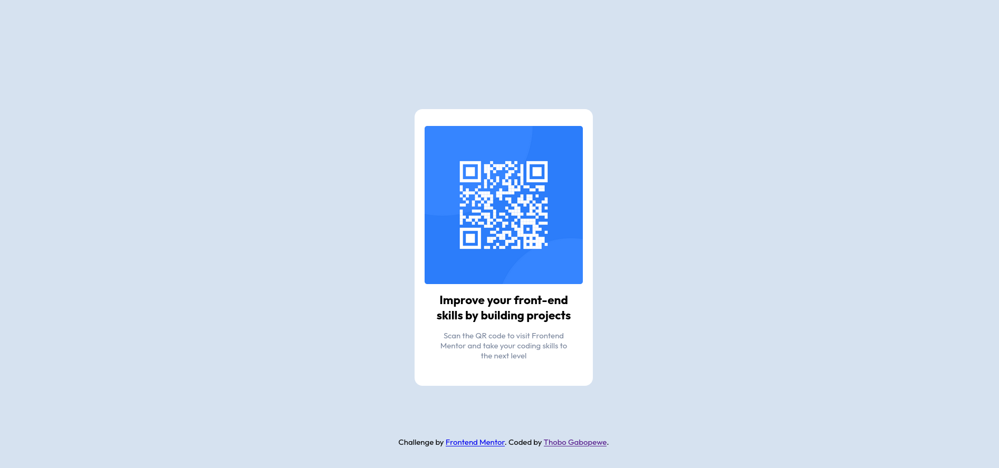

# Frontend Mentor - QR code component solution

This is a solution to the [QR code component challenge on Frontend Mentor](https://www.frontendmentor.io/challenges/qr-code-component-iux_sIO_H). Frontend Mentor challenges help you improve your coding skills by building realistic projects. 

## Table of contents

- [Overview](#overview)
  - [Screenshot](#screenshot)
  - [Links](#links)
- [My process](#my-process)
  - [Built with](#built-with)
  - [Continued development](#continued-development)
  - [Useful resources](#useful-resources)
- [Author](#author)

## Overview

### Screenshot

#### Desktop

#### Mobile

### Links

- Solution URL: [gaboipewe-t/qr-code-component-main](https://github.com/gaboipewe-t/qr-code-component-main)
- Live Site URL: [Add live site URL here](https://your-live-site-url.com)

## My process

### Built with

- Flexbox
- CSS Grid

### Continued development

Cross platform full stack development

### Useful resources

- [MDN](https://developer.mozilla.org/en-US/)

## Author

- Frontend Mentor - [@gaboipewe-t](https://www.frontendmentor.io/profile/gaboipewe-t)
- Twitter - [@gaboipewe_thobo](https://www.twitter.com/gaboipewe_thobo)
